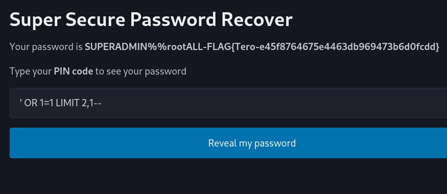

<a name="h2-break--unbreak"></a>
# 🔓 H2 Break & unbreak


<a name="contents"></a>
## 📑 Contents

<!-- @import "[TOC]" {cmd="toc" depthFrom=1 depthTo=6 orderedList=false} -->

<!-- code_chunk_output -->

- [🔓 H2 Break & unbreak](#-h2-break--unbreak)
  - [📑 Contents](#-contents)
  - [📋 Assignments](#-assignments)
    - [📝 X) Read and Summarize Task](#-x-read-and-summarize-task)
      - [🔗 OWASP Top 10 A01 - Broken Access Control](#-owasp-top-10-a01---broken-access-control)
      - [🔍 Fuzzing with ffuf](#-fuzzing-with-ffuf)
      - [🔐 Access Control Vulnerabilities (by portswigger)](#-access-control-vulnerabilities-by-portswigger)
      - [:pencil: Writing reports (Karvinen 2006)](#pencil-writing-reports-karvinen-2006)
  - [🔓  A) Breaking into 010-staff-only](#--a-breaking-into-010-staff-only)
  - [🔧 B) Fixing the 010-staff-only](#-b-fixing-the-010-staff-only)
  - [🕵️ C) Solving dirfuzt-1](#️-c-solving-dirfuzt-1)
  - [💻 D) Hack 020-your-eyes-only](#-d-hack-020-your-eyes-only)
  - [🛠️ E) Fixing 020-your-eyes-only](#️-e-fixing-020-your-eyes-only)
  - [🛠️ Tools & Hardware Used](#️-tools--hardware-used)
  - [📂 Resources](#-resources)

<!-- /code_chunk_output -->


<a name="assignments"></a>
## 📋 Assignments

<details>

x) Read/watch/listen and summarize. (There is no need to take tests on the computer in this subsection x, just reading or listening and summarizing is enough. A few lines of French are enough for summarizing.)
OWASP: [OWASP Top 10: A01 Broken Access Control](https://owasp.org/Top10/A01_2021-Broken_Access_Control/)
Karvinen 2023: [Find Hidden Web Directories - Fuzz URLs with ffuf](https://terokarvinen.com/2023/fuzz-urls-find-hidden-directories/)
PortSwigger: [Access control vulnerabilities and Privilege Escalation](https://portswigger.net/web-security/access-control)
Karvinen 2006: [Writing the report](https://terokarvinen.com/2006/raportin-kirjoittaminen-4/)
Voluntary: [PortSwigger 2020: What is SQL injection? - Web Security Academy (about 10 min video)](https://www.youtube.com/watch?v=wX6tszfgYp4)

a) Break into 010-staff-only. See Karvinen 2024: Hack'n Fix

b) Fix the 010-staff-only vulnerability in the source code. Show with a test that your solution works.

c) Solve dirfuzt-1 from the article Karvinen 2023: Find Hidden Web Directories - Fuzz URLs with ffuf. This will help solve 020-your-eyes-only.

d) Hack 020-your-eyes-only. See Karvinen 2024: Hack'n Fix

e) Fix the 020-your-eyes-only vulnerability. Show with a test that your solution works.

g) Voluntary. An introductory quest to help solve 010-staff-only. Solve Portswigger Academy's "Lab: SQL injection Vulnerability in WHERE clause allowing retrieval of Hidden data".

h) Voluntary. An introductory quest to help solve 010-staff-only. Solve Portswigger Academy's "Lab: SQL injection Vulnerability allowing login bypass"

</details>

<a name="x-read-and-summarize-task"></a>
### 📝 X) Read and Summarize Task

<a name="owasp-top-10-a1---broken-access-control"></a>
#### 🔗 OWASP Top 10 A01 - Broken Access Control

OWASP A1 Broken access control is considered as the most serious web app risk since 2021 on the OWASP top10 list. 

In short, broken access control means there are vulnerabilities/bugs/misconfigurations with authentication.

Examples of broken access control:
- Accidental privileges for actions
- Bypassing access control by modifying the URL (parameter tampering)
- Accessing API:s with missing access control
- Privilege elevation (Access admin with normal user)
etc..

The article also talks about prevention and examples.


<a name="fuzzing-with-ffuf"></a>
#### 🔍 Fuzzing with ffuf

Fuzzing is similiar to brute forcing but we are not cracking hashes but finding directories, commands, subdomains etc. on websites.

ffuf is considered the fastest fuzzing tool currently.

<a name="access-control-vulnerabilities"></a>
#### 🔐 Access Control Vulnerabilities (by portswigger)

The article covers weaknesses in web app authentication, session managment and access control.

Some examples:

**Vertical privilege escalation**
user gains access to functions they should not have access to(user to admin).
admin panel accessable with normal user
leaked info in robots.txt

**Parameter based access control**
Gaining access with hidden fields, cookies..

**Horizontal privilege escalation**
Gaining access to another users data, often also used horizontal to vertical escalation.

The article also hosts labs to try out the different vulnerabilities.

<a name="writing-reports"></a>
#### :pencil: Writing reports (Karvinen 2006)

Guide and best practices on how to create homework writeup reports.

Key points:
- Actions have be easily replicated by reader
- Accurate, write what you clicked and what command you used, did it work?
- Easy to read, use headers, avoid typos..
- Mention sources
- NO plagiarism, NO bullshit


<a name="a-breaking-into-010-staff-only"></a>
## 🔓  A) Breaking into 010-staff-only

*Task already completed during class, memorizing and doing it again*

First we need to setup the task, download unzip and run


Enter 010-staff-only folder and run ```python3 staff-only.py```

now server is online at http://127.0.0.1:5000/

First i tested if injection is possible, with basic 'OR 1=1-- injection


I see that the app has some kind of protection, seems like its client side

A quick inspect on the form shows that its looking for a number, lets remove this


The injection now works, but this is not the flag


Lets find the real password searching table with limit command

```' OR 1=1 LIMIT 2,1-- ```




 **FLAG{Tero-e45f8764675e4463db969473b6d0fcdd}**

<a name="b-fixing-the-010-staff-only"></a>
## 🔧 B) Fixing the 010-staff-only

Looking at the code at first feeling lost, then did some research on how to detect vulnerabilities in python code(without using AI), found **bandit** app


Bandit tells us about possible sql injection that we know works, also tells us about the hardcoded password, but that was not the task to solve.

After reading report tried to edit alot in this section without solution:

```diff
	sql = "SELECT password FROM pins WHERE pin='"+pin+"';"
	row = ""
	with app.app_context():
		res=db.session.execute(text(sql))
		db.session.commit()
		row = res.fetchone()
```


Could not solve without some assistance, went to tips and saw a hint to look into the library

After some google search found some guides and youtube videos but were not able to connect the dots.

https://medium.com/@shrimantshubham/flask-sqlalchemy-tutorial-login-system-with-python-61a3ab9f4990

https://pynative.com/python-mysql-execute-parameterized-query-using-prepared-statement/

https://www.youtube.com/watch?v=vMkHXB1aPL4

I wanted to avoid going to chatgpt for help, but then decided to go that route instead of giving up. [chat_pt1](images/image-25.png) [chat_pt2](images/image-26.png)

```diff
-	sql = "SELECT password FROM pins WHERE pin='"+pin+"';"
+	sql = text("SELECT password FROM pins WHERE pin=:pin")
	row = ""
	with app.app_context():
-		res=db.session.execute(text(sql))
+		res=db.session.execute(sql, {"pin": pin})
		db.session.commit()
		row = res.fetchone()
```

Not sure if this is the way but it seems to have fixed the previously working injection. im getting (not found).


ChatGPT also provided tips to create server side input validation with

```
    if not pin.isdigit():
        return "Invalid input", 400
```
this results to invalid input page when trying to inject sql into form


final code compared to original:

```diff
#!/usr/bin/python3
# Copyright 2018-2024 Tero Karvinen http://TeroKarvinen.com
#########################################
# WARNING: Purposefully VULNERABLE APP! #
#########################################

from flask import Flask, render_template, request # sudo apt-get install python3-flask
from flask_sqlalchemy import SQLAlchemy # sudo apt-get install python3-flask-sqlalchemy
from sqlalchemy import text

app = Flask(__name__)
app.config['SQLALCHEMY_DATABASE_URI'] = 'sqlite:///:memory:'
db = SQLAlchemy(app)

@app.route("/", methods=['POST', 'GET'])
def hello():
    if "pin" in request.form:
        pin = str(request.form['pin'])
    else:
        pin = "0"
+   if not pin.isdigit():
+       return "Invalid input", 400

-   sql = "SELECT password FROM pins WHERE pin='"+pin+"';"
+   sql = text("SELECT password FROM pins WHERE pin=:pin")
    row = ""
    with app.app_context():
-       res=db.session.execute(text(sql))
+       res=db.session.execute(sql, {"pin": pin})
        db.session.commit()
        row = res.fetchone()

    if row is None:
        password="(not found)"
    else:
        password=row[0]
    return render_template('index.html', password=password, pin=pin, sql=sql)

def runSql(sql):
    with app.app_context():
        res=db.session.execute(text(sql))
        db.session.commit()
        return res

def initDb():
    # For simplifying the demo, passwords are also incorrectly stored as plain text. 
    # However, that's not the only thing that's wrong.
    runSql("CREATE TABLE pins (id SERIAL PRIMARY KEY, pin VARCHAR(17), password VARCHAR(20));")
    runSql("INSERT INTO pins(pin, password) VALUES ('321', 'foo');")
    runSql("INSERT INTO pins(pin, password) VALUES ('123', 'Somedude');")
    runSql("INSERT INTO pins(pin, password) VALUES ('11112222333', 'SUPERADMIN%%rootALL-FLAG{Tero-e45f8764675e4463db969473b6d0fcdd}');")
    runSql("INSERT INTO pins(pin, password) VALUES ('321', 'loremipsum');")

if __name__ == "__main__":
    print("WARNING: Purposefully VULNERABLE APP!")
    initDb()
    app.run() # host="0.0.0.0" to serve non-localhost, e.g. from vagrant; debug=True for debug

```

ChatGPT also [suggested](h2images/image-26.png) using ORM query instead of paremeterized query, but since the tips suggested to use parameterized, i went with that solution.


<a name="c-solving-dirfuzt-1"></a>
## 🕵️ C) Solving dirfuzt-1

As a tutorial to fuzz i did the dirfuzt-0 challenge, now onto dirfuzt-1:

First step was to download the target app and running it


Downloading and running ffuf using dirbuster wordlist

```
ffuf -w /usr/share/wordlists/dirbuster/directories.jbrofuzz -u http://127.0.0.2:8000/FUZZ -mc all -fs 42 -c -v
```


scanned 58k dirs, now unwanted positive seems to be size 154, lets add  ```-fs 154``` to the command


Found the flag to admin page
``` FLAG{tero-wpadmin-3364c855a2ac87341fc7bcbda955b580} ``` 

now swapping to common.txt since still need to find version control related page


Found it
``` FLAG{tero-git-3cc87212bcd411686a3b9e547d47fc51} ``` 


<a name="d-hack-020-your-eyes-only"></a>
## 💻 D) Hack 020-your-eyes-only

Setup target


created a user just to look around


previous task mentioned fuzzing might be needed, lets try
``` ffuf -w /usr/share/wordlists/dirbuster/directories.jbrofuzz -u http://127.0.0.1:8000/FUZZ -mc all -fs 42 -c -v ```


seems to be different sizes of 404, quick google resulted to an old article(https://josephthacker.com/hacking/2020/10/27/ffuf-filters.html) mentioning autocalibrate 

adding ```-ac``` to the command, found admin-console


admin console is just an empty page


this does not seem to get me anywhere, continue trying different sql injections into the login form..

while inspecting, found hidden csrf input, made it visible


tried to edit this field also without success of access / injection


Lots of googling leads me to trying csrf bypass (https://portswigger.net/web-security/csrf/bypassing-token-validation)

failing at this i then tried lots of different fuzzing commands

```
ffuf -u http://127.0.0.1:8000/admin-console/?FUZZ=true -w /usr/share/seclists/Discovery/Web-Content/burp-parameter-names.txt -b "sessionid=7cxnskafc4x892jk2tojmcxkfe4bgl8s" -ac
```
some 5 hours later i give up since i feel lost and on wrong track.

I go back to hack n fix page for some tips, it seems i already found the "flag" was the admin page. **I did not read the task well enough.. and was looking for a flag** 😵

<a name="e-fixing-020-your-eyes-only"></a>
## 🛠️ E) Fixing 020-your-eyes-only

I browse around the folders inside /020-your-eyes-only spamming cat on all py files until i find something related to admin-console

found urls.py

i try editing the admin-console to same as admin-dashboard

```diff
from django.urls import path
from django.views.generic import TemplateView
from .views import *

urlpatterns = [
	path('', TemplateView.as_view(template_name="hats/frontpage.html"), name="frontpage"),
	path('my-data/', MyDataView.as_view(), name="my-data"),
	path('admin-dashboard/', AdminDashboardView.as_view(), name="admin-dashboard"),
-	path('admin-console/', AdminShowAllView.as_view(), name="admin-console"),
+       path('admin-console/', AdminDashboardView.as_view(), name="admin-console"),
]
```


It seems to work, after restarting the server i cant access admin-console anymore:


<a name="tools-used"></a>
## 🛠️ Tools & Hardware Used

- Kali vm
- Python
- ffuf
- bandit
- chatgpt

**Hardware**
- amd 5900x
- rtx 3080
- 32gb ddr4


<a name="resources"></a>
## 📂 Resources

OWASP Top 10: A01 Broken Access Control
https://owasp.org/Top10/A01_2021-Broken_Access_Control/
(OWASP)

Writing reports 
https://terokarvinen.com/2006/raportin-kirjoittaminen-4/
(Karvinen 2006)

Find Hidden Web Directories - Fuzz URLs with ffuf 
https://terokarvinen.com/2023/fuzz-urls-find-hidden-directories/
(Karvinen 2023)

Access control vulnerabilities and Privilege Escalation
https://portswigger.net/web-security/access-control
(Portswigger)


https://www.youtube.com/watch?v=wX6tszfgYp4
(PortSwigger 2020)

[ChatGPT pt1](h2images/image-25.png)

[ChatGPT pt2](h2images/image-26.png)

