<a name="h3---no-strings-attached"></a>
# 🧵 H3 - No Strings Attached

<a name="contents"></a>
## 📑 Contents

- [🧵 H3 - No Strings Attached](#h3---no-strings-attached)
  - [📑 Contents](#contents)
  - [🔍 A) Strings](#a-strings)
  - [🛠️ B) Modify passtr.c](#b-modify-passtrc)
  - [📦 C) Packd](#c-packd)
  - [🔒 D) Optional Bonus: Cryptopals](#d-optional-bonus-cryptopals)
  - [🛠️ Tools and Hardware Used](#tools-and-hardware-used)
  - [📂 Resources](#resources)


<a name="a-strings"></a>
## 🔍 A) Strings
Download `ezbin-challenges.zip` and run `passtr`. Use `strings` to determine the correct password and identify the flag. Try not to look at the source code if possible.

First downloading the challenge with 

```
 wget https://terokarvinen.com/loota/yctjx7/ezbin-challenges.zip
```
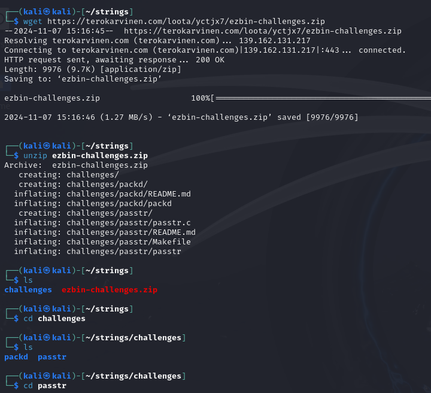

unzip, enter folder and then i run 

```
strings passtr
```


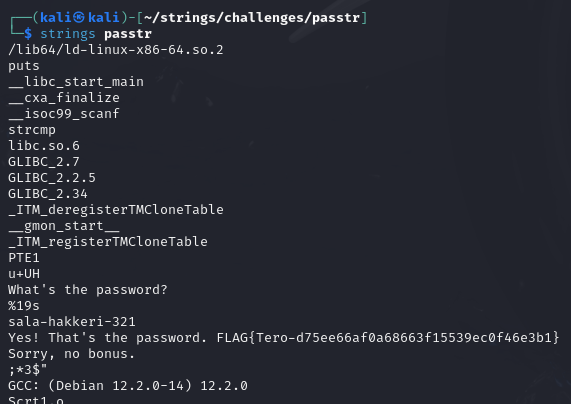

instantly see potential password after the question, sala-hakkeri-321


lets run and test the password *sala-hakkeri-321*
```
./passtr
```
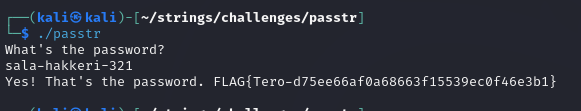

**it works**, moving on!


<a name="b-modify-passtrc"></a>
## 🛠️ B) Modify passtr.c
Create a modified version of `passtr.c` so the password is not directly visible in the binary. Demonstrate through a test that the password is hidden. (Obfuscation is enough.)


Not very familiar with c, googled how to obfuscate strings in c, found this https://yurisk.info/2017/06/25/binary-obfuscation-string-obfuscating-in-C/

implemented onto tero:s app

```
#include <stdio.h>
#include <string.h>

#define HIDE_LETTER(a)   ((a) + 0x50)
#define UNHIDE_STRING(str)  do { char *ptr = str; while (*ptr) *ptr++ -= 0x50; } while(0) 
#define HIDE_STRING(str)  do { char *ptr = str; while (*ptr) *ptr++ += 0x50; } while(0)

int main() {
    char password[20];

    // obfuscation
    char hidden_password[] = {
        HIDE_LETTER('s'), HIDE_LETTER('a'), HIDE_LETTER('l'), HIDE_LETTER('a'),
        HIDE_LETTER('-'), HIDE_LETTER('h'), HIDE_LETTER('a'), HIDE_LETTER('k'),
        HIDE_LETTER('k'), HIDE_LETTER('e'), HIDE_LETTER('r'), HIDE_LETTER('i'),
        HIDE_LETTER('-'), HIDE_LETTER('3'), HIDE_LETTER('2'), HIDE_LETTER('1'), '\0'
    };

    printf("What's the password?\n");
    scanf("%19s", password);

    // unhide while running
    UNHIDE_STRING(hidden_password);
    
    // reveal while password check
    if (strcmp(password, hidden_password) == 0) {
        printf("Yes! That's the password. FLAG{Tero-d75ee66af0a68663f15539ec0f46e3b1}\n");
    } else {
        printf("Sorry, no bonus.\n");
    }

    // hide password after
    HIDE_STRING(hidden_password);

    return 0;
}
```
In this code, the password character has 80 (0x50) added to its ASCII value making it unrecognizable for strings


After editing file I compile with the command ```make``` 

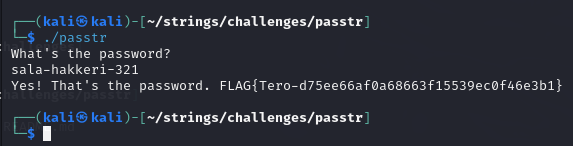
Program still works

Password is now hidden with strings:

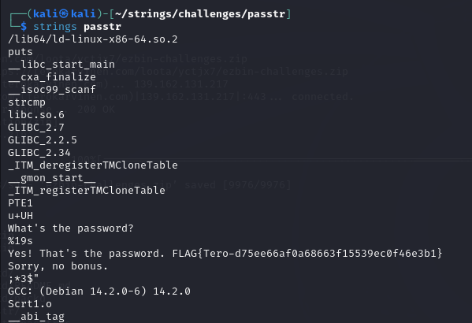


<a name="c-packd"></a>
## 📦 C) Packd
Run `packd` from the `ezbin-challenges.zip` package. Determine the password and the flag. This is a more challenging task—document your approaches and hypotheses as you work.

Lets first try strings
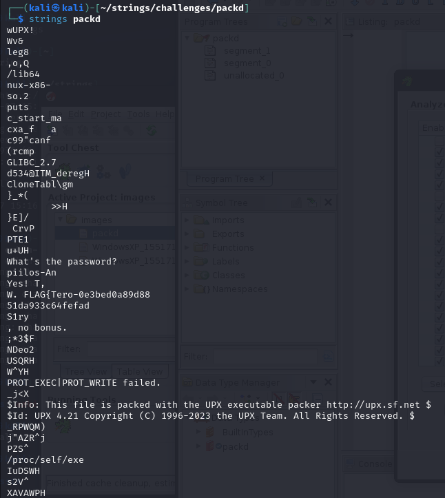
seems to contain some info, tried to enter password piilos-An and some other combinations, but not working.


Course schedule mentions ghidra, and i tried it before for something else, ill see if i can find something 
import file -> analyze yes
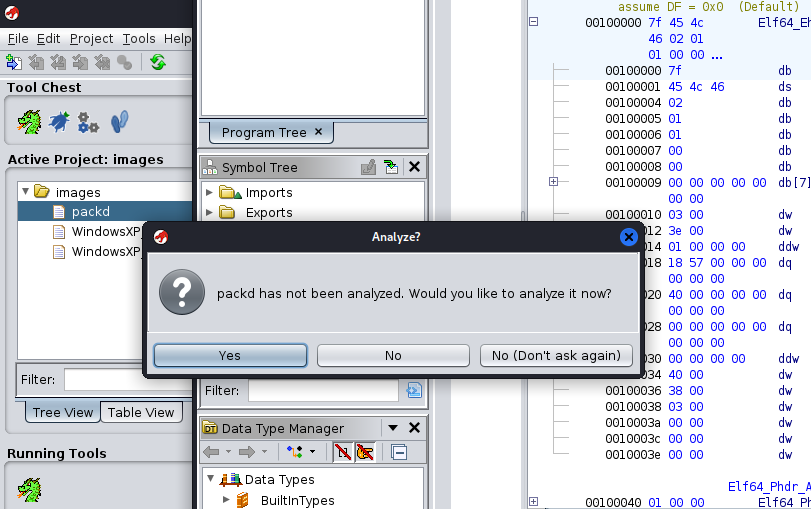

default settings(analyzers)
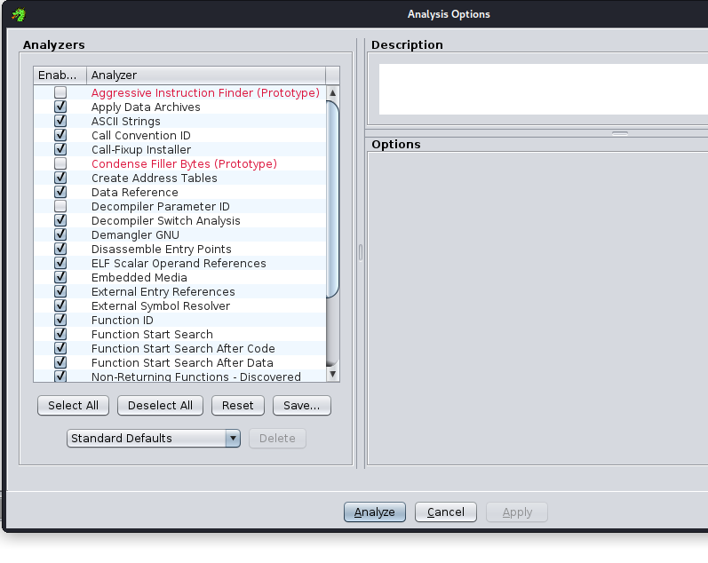

browse around the data but nothing makes sense to me.


Returning to task after a while.
Looking at task hints, its saying to use strings

Going back to the strings result i realise something i didnt see in the first challenge

upx packed executable
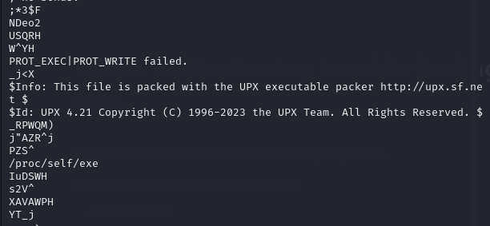

i did some google and found an [article](https://www.iblue.team/malware-analysis/identifying-upx-packed-elf-decompressing-fixing-and-analysing-linux-malware) talking about upx packed executables and how to unpac (upx -d)

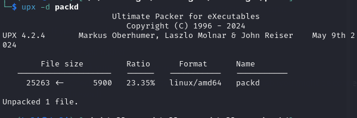

reading the strings again
```
strings packd
```

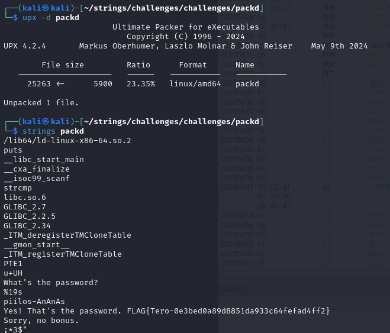

Now I can see the password in plain text, "piilos-AnAnAs"

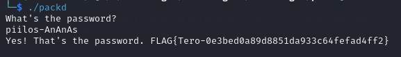

``` 
FLAG{Tero-0e3bed0a89d8851da933c64fefad4ff2}
```


<a name="d-optional-bonus-cryptopals"></a>
## 🔒 D) Optional Bonus: Cryptopals
Crypto Challenge Set 1. Work on this over multiple weeks if needed. If you complete up to "4. Detect single-character XOR," you’re already stepping into the world of cryptography.
https://www.cryptopals.com/sets/1

#### D) Challenge 1 

Converting hex to base, i google linux terminal converting hex to base, first hit https://superuser.com/questions/158142/how-can-i-convert-from-hex-to-base64

has an example ```echo "6F0AD0BFEE7D4B478AFED096E03CD80A" | xxd -r -p | base64```

Now using it on our challenge

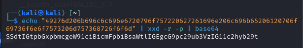
And getting the correct answer.

#### D) Challenge 2

Trying to google some guidance on this, I find mostly people asking the exact question and getting a working function. This however does not help me understand why and how. 

```
import binascii

# Define the input hex strings
hex_string1 = "1c0111001f010100061a024b53535009181c"
hex_string2 = "686974207468652062756c6c277320657965"

# Decode the hex strings into byte buffers
buffer1 = binascii.unhexlify(hex_string1)
buffer2 = binascii.unhexlify(hex_string2)

print(hex_string1)
print(hex_string2)

# Perform XOR operation and get the result as hex
xor_result = bytes(a ^ b for a, b in zip(buffer1, buffer2))
print(binascii.hexlify(xor_result).decode())
```

this code does the task, but still i did not understand exactly how/why. 

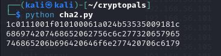

Did not want to move on before some better understanding of the process.

Spent lots of time reading about the calculation, did another script with chatGPT to help me understand the steps and calculation. 


```
import binascii

# Define the input hex strings
hex_string1 = "1c0111001f010100061a024b53535009181c"
hex_string2 = "686974207468652062756c6c277320657965"

# Decode the hex strings into byte buffers
buffer1 = binascii.unhexlify(hex_string1)
buffer2 = binascii.unhexlify(hex_string2)

# Print hex strings in binary
print("Binary representation of string1:")
print(' '.join(format(byte, '08b') for byte in buffer1))

print("\nBinary representation of string2:")
print(' '.join(format(byte, '08b') for byte in buffer2))

# Perform XOR calculation with binary output for each step
print("\nXOR Calculation Steps:")
for a, b in zip(buffer1, buffer2):
    xor_byte = a ^ b
    print(f"{a:02x} ({format(a, '08b')}) XOR {b:02x} ({format(b, '08b')}) = {xor_byte:02x} ({format(xor_byte, '08b')})")

# Perform XOR operation and get the result as bytes
xor_result = bytes(a ^ b for a, b in zip(buffer1, buffer2))

# Print final XOR result in hex
print("\nFinal XOR Result (Hex):")
print(binascii.hexlify(xor_result).decode())
```

Its finally making some sense:

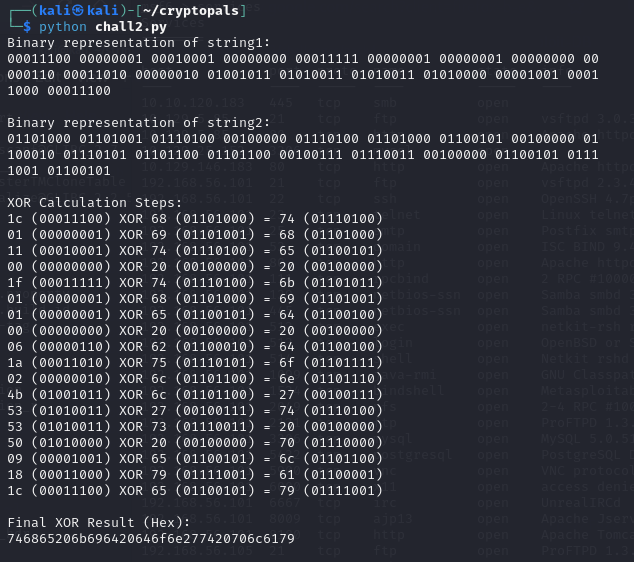

#### D) Challenge 3

converted previous code with [chatGPT](h3images/image-15.png) to try all alphabet letters on a hex string:

```
import binascii
import string

# Define the hex-encoded string
hex_string = "1b37373331363f78151b7f2b783431333d78397828372d363c78373e783a393b3736"  # This represents "KEY" in hex

# Decode the hex string to bytes
key_bytes = binascii.unhexlify(hex_string)

# Create a list of alphabet letters as bytes
alphabet = [bytes([ord(char)]) for char in string.ascii_lowercase]

# XOR each letter of the alphabet with each byte in the key and convert to a readable string
for letter in alphabet:
    xor_results = ''.join(chr(letter[0] ^ byte) for byte in key_bytes)
    print(f"{chr(letter[0])} = {xor_results}")
```
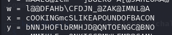


<a name="tools-and-hardware-used"></a>
## 🛠️ Tools and Hardware Used
- Hardware: AMD 5900X, RTX 3080, 32GB RAM
- Software: Strings, Ghidra, python


<a name="resources"></a>
## 📂 Resources

https://terokarvinen.com/application-hacking/

https://www.iblue.team/malware-analysis/identifying-upx-packed-elf-decompressing-fixing-and-analysing-linux-malware

https://www.howtogeek.com/427805/how-to-use-the-strings-command-on-linux/

https://yurisk.info/2017/06/25/binary-obfuscation-string-obfuscating-in-C/

https://superuser.com/questions/158142/how-can-i-convert-from-hex-to-base64

https://www.cryptopals.com/sets/1