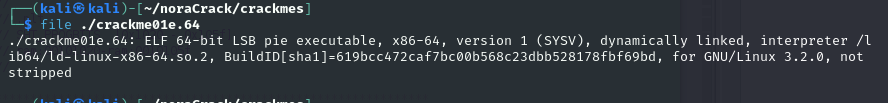

<a name="h4---kääntöpaikka"></a>
# 🔄 H4 - Kääntöpaikka

<a name="contents"></a>
## 📑 Contents

- [🔄 H4 - Kääntöpaikka](#-h4---kääntöpaikka)
  - [📑 Contents](#-contents)
  - [📋 Assignments](#-assignments)
    - [📝 X) Read and Summarize Task](#-x-read-and-summarize-task)
      - [🔍 Ghidra for Reverse Engineering](#-ghidra-for-reverse-engineering)
      - [📚 Optional: The Ghidra Book](#-optional-the-ghidra-book)
  - [🛠️ A) Install Ghidra](#️-a-install-ghidra)
  - [📜 B) Reverse Engineer packd to C with Ghidra](#-b-reverse-engineer-packd-to-c-with-ghidra)
  - [🔧 C) Modify passtr Binary to accept all but the right password](#-c-modify-passtr-binary-to-accept-all-but-the-right-password)
  - [🎯 D) Nora CrackMe Overview](#-d-nora-crackme-overview)
  - [🧩 E) Solve Nora crackme01](#-e-solve-nora-crackme01)
  - [🧩 F) Solve Nora crackme01e](#-f-solve-nora-crackme01e)
  - [🧩 G) Solve Nora crackme02](#-g-solve-nora-crackme02)
  - [🌀 H) Optional: Explore Multiple Solutions on crackme01](#-h-optional-explore-multiple-solutions-on-crackme01)
  - [🌀 I) Optional: Find Both Solutions crackme02](#-i-optional-find-both-solutions-crackme02)
  - [🌟 J) Optional: Solve Nora crackme02e](#-j-optional-solve-nora-crackme02e)
  - [🛠️ Tools and Hardware Used](#️-tools-and-hardware-used)
  - [📂 Resources](#-resources)

<a name="assignments"></a>
## 📋 Assignments

<details> <summary>Click to expand</summary>
X) Read/Watch/Listen and Summarize

Hammond 2022: Ghidra for Reverse Engineering (Video, ~20 min)
Optional: Eagle and Nancy 2020: The Ghidra Book, Chapter 2
A) Install Ghidra

Install and prepare Ghidra for reverse engineering tasks.
B) Reverse Engineer packd

Use Ghidra to decompile packd and explain its functionality.
C) Modify passtr Binary

Modify passtr to accept all passwords except the correct one.
D) Nora CrackMe

Build and analyze binaries from NoraCodes/crackmes.
E) Solve Nora crackme01

F) Solve Nora crackme01e

G) Solve Nora crackme02

Decompile and explain the functionality of crackme02.
H) Optional: Explore Multiple Solutions

Find multiple solutions for crackme01.
I) Optional: Find Both Solutions

Identify both solutions for crackme02.
J) Optional: Solve Nora crackme02e

Tackle the more challenging crackme02e.
</details>

<a name="x-read-and-summarize-task"></a>
### 📝 X) Read and Summarize Task

<a name="ghidra-for-reverse-engineering"></a>
#### 🔍 Ghidra for Reverse Engineering

Videolog about completing a challenge in PicoCTF 2022 called bbbloat

task is to reverse engineer a linux binary, start with installing some useful apps like ltrace.

running ltrace and strace, then objdump looking for the "password" string. no success.

used file command to see that its a stripped binary.(stripped binaries does not contain debugging info)

Going into installing ghidra and then running it, analyzing the binary

Window -> Defined data. looking for the favourite number entry

Renaming functions in the decompile window

he finds a function where it checks if answer is equal to a hex number, converts it to decimal and it works, flag captured.

<a name="optional-the-ghidra-book"></a>
#### 📚 Optional: The Ghidra Book

unable to access material currently, skipped this optional task

<a name="a-install-ghidra"></a>
## 🛠️ A) Install Ghidra

Previously installed ghidra11 during class. also needs java sdk.

'sudo apt-get install openjdk-17-jdk'


<a name="b-reverse-engineer-packd"></a>
## 📜 B) Reverse Engineer packd to C with Ghidra

Opening packd in ghidra


Open the file and yes to analyze. This file was not yet unpacked as per previous task, not sure if its allowed but i went ahead and `upx -d` to make some more sense into the decompilation results.


After unpacking the main function is found instantly in the symbol tree.


main function:


Renaming some functions and added explanations:

```diff
undefined8 main(void)

{
// this is the main function
undefined8 main(void)

{
// int difference compares the result of input to  the password
  int difference;
// this is the input
  char input [32];

// prints question  
  puts("What\'s the password?");
// scans for input
  __isoc99_scanf(&DAT_0010201d,input);
// compares input and password difference
  difference = strcmp(input,"piilos-AnAnAs");
// if input&pw difference = 0, print flag, else no bonus.
  if (difference == 0) {
    puts("Yes! That\'s the password. FLAG{Tero-0e3bed0a89d8851da933c64fefad4ff2}");
  }
  else {
    puts("Sorry, no bonus.");
  }
// exit program
  return 0;
}
```

my C is not strong enough to make it compileable from here, but with chatGPT it was easily [done](h4images/image-5.png)

```
#include <stdio.h>
#include <string.h>

int main(void) {
    int difference;
    char input[32];
    
    puts("What's the password?");
    scanf("%31s", input); // Use "%31s" to avoid buffer overflow
    difference = strcmp(input, "piilos-AnAnAs");
    if (difference == 0) {
        puts("Yes! That's the password. FLAG{Tero-0e3bed0a89d8851da933c64fefad4ff2}");
    } else {
        puts("Sorry, no bonus.");
    }
    return 0;
}
```
inserted code to file pakki.c then:
`gcc -o main pakki.c` 
successfully compiled and tested running and working:


<a name="c-modify-passtr-binary"></a>
## 🔧 C) Modify passtr Binary to accept all but the right password

Starting with opening file in ghidra, choose analyze yes.

from symbol tree, i open the main function


from here we want to edit the if function that checks if iVar == 0, to != 0, we can press the if function to show us the location in assembly and edit it there.


jnz is the part we want to edit to jz, rightclicking it and choosing patch instruction:


edited assembly:


then going to file -> export program


export as original file

now we can give it permissions and test if it works:


works as intended, "wrong" passwords pass, and the old "correct" password is now wrong.

<a name="d-nora-crackme-overview"></a>
## 🎯 D) Nora CrackMe Overview

Setup and compile, cloning repo, make crackme1


make all


<a name="e-solve-nora-crackme01"></a>
## 🧩 E) Solve Nora crackme01

running, the binary


strings on the binary reveals password1?


lets try:


Cracked

<a name="f-solve-nora-crackme01e"></a>
## 🧩 F) Solve Nora crackme01e

strings on 01e:


pass seems to be obfuscated?, lets investigate with ghidra(new file analyze yes, symbol tree -> main function):


got derailed for an hour trying to figure out what else it could be 

<details><summary>Expand derail path</summary>

file not stripped



spent some time with ltrace and strace


spent some time with gdb


</details>


until tried slm!paas.k again with correct syntax:


OR


<a name="g-solve-nora-crackme02"></a>
## 🧩 G) Solve Nora crackme02

starting with strings:


cant be password1? have to try it anyway


checking strace and ltrace, cant see a solution there.

going into ghidra for reversing code


named variables, spents lots of time trying to figure it out without help. 
"giving up" and asking chatgpt for guidance and solutions:

my partly renamed code with **commentary from gpt4o** for me to understand it better
```
#include <stdio.h>

undefined8 main(int param_1, long param_2)
{
    char passwordCharacter; // Holds the current character of the password being checked.
    undefined8 uVar1; // Return value of the function.
    long characterCount; // Counter for the position in the input and password.
    char inputCharacter; // Holds the current character of the user input being checked.

    // Check if exactly one argument is passed to the program.
    if (param_1 == 2) {
        passwordCharacter = 'p'; // Initialize the first expected password character ('p').
        characterCount = 0; // Initialize the counter for iterating through the input and password.

        do {
            // Retrieve the current character from the user's input based on characterCount.
            inputCharacter = *(char *)(*(long *)(param_2 + 8) + characterCount);

            // If the end of the input string is reached, break out of the loop.
            if (inputCharacter == '\0') break;

            // Compare the user input character to the value of the expected password character minus 1.
            // The user must supply a character whose decimal value is exactly one less
            // than the expected password character's value.
            if ((int)inputCharacter != passwordCharacter - 1) {
                // If the input does not match the expected obfuscated password character,
                // print a failure message and exit with an error code.
                printf("No, %s is not correct.\n", (char *)(*(long *)(param_2 + 8)));
                return 1;
            }

            // Move to the next password character in the "password1" string.
            passwordCharacter = "password1"[characterCount + 1];

            // Increment the counter to process the next character.
            characterCount = characterCount + 1;

        } while (passwordCharacter != '\0'); // Continue until the end of the password string is reached.

        // If all characters match, print a success message and return success code.
        printf("Yes, %s is correct!\n", (char *)(*(long *)(param_2 + 8)));
        uVar1 = 0; // Return success.
    } else {
        // If the incorrect number of arguments is provided, print a usage message and return an error code.
        puts("Need exactly one argument.");
        uVar1 = 0xffffffff; // Return error code.
    }

    return uVar1; // Return the final status code.
}

```

To crack the binary it seems i have to transform 'password1' to its ascii decimal number, then subtract 1 from the value, and transform back.

string: password1
decimal: 112 97 115 115 119 111 114 100 49

subtracted 1 from decimal character codes:
111 98 114 114 118 110 113 99 48


password "o`rrvnqc0"


<a name="h-optional-explore-multiple-solutions"></a>
## 🌀 H) Optional: Explore Multiple Solutions on crackme01

pass for now..

<a name="i-optional-find-both-solutions"></a>
## 🌀 I) Optional: Find Both Solutions crackme02

During previous tasks, tried different combinations and found empty to work


<a name="j-optional-solve-nora-crackme02e"></a>
## 🌟 J) Optional: Solve Nora crackme02e

Doing some renaming similiarly to previous guide:


notice start with y, but pass dont have y

Did not have time to investigate further, noticed empty password works here also. bypassing the do while loop


<a name="tools-and-hardware-used"></a>
## 🛠️ Tools and Hardware Used
- Hardware: ThinkPad L14, Ryzen 4500, 32gb ram
- Software: strings file ltrace strace ghidra gdb

<a name="resources"></a>
## 📂 Resources

https://www.youtube.com/watch?v=oTD_ki86c9I
(GHIDRA for Reverse Engineering (PicoCTF 2022 #42 'bbbloat')))

https://www.rapidtables.com/convert/number/ascii-hex-bin-dec-converter.html

https://terokarvinen.com/application-hacking/

http://sticksandstones.kstrom.com/appen.html