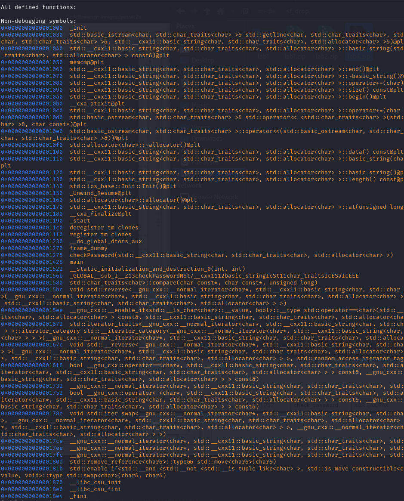

<a name="h5---its-alive"></a>
# ⚡ H5 - It’s Alive!

<a name="contents"></a>
## 📑 Contents

- [⚡ H5 - It’s Alive!](#h5---its-alive)
  - [📑 Contents](#contents)
  - [📋 Assignments](#assignments)
  - [🧪 A) Lab1 - Investigate and Fix](#a-lab1---investigate-and-fix)
  - [🔍 B) Lab2 - Find Password and Flag](#b-lab2---find-password-and-flag)
  - [🧩 C) Lab3 - Nora Crackmes](#c-lab3---nora-crackmes)
  - [🌀 D) Lab4 - Optional Crackmes.one](#d-lab4---optional-crackmesone)
  - [🛠️ Tools and Hardware Used](#tools-and-hardware-used)
  - [📂 Resources](#resources)

<a name="assignments"></a>
## 📋 Assignments

<details> <summary>Click to expand</summary>
A) Lab1 - Investigate and Fix
Investigate what is wrong with the program in lab1.zip and how it can be fixed.

B) Lab2 - Find Password and Flag
Extract the password and the flag from lab2.zip and write a report explaining the process.

C) Lab3 - Nora Crackmes
Solve exercises 3 and 4 from Nora Crackmes. Additional exercises are optional.

D) Lab4 - Optional
Solve a Crackmes.one challenge in lab4.zip (available in Moodle). Discover the password.

</details>

<a name="a-lab1---investigate-and-fix"></a>
## 🧪 A) Lab1 - Investigate and Fix
Investigate the issues in the program from `lab1.zip` and explain how they can be resolved.

Start with unzipping file and running it:


Running the bin in gdb:


Segmentation fault on line 7, this means app is trying to access a part of memory that it is not alled into. [Source](https://www.javatpoint.com/segmentation-fault-in-c)

Looking through our material and tutorials, similiar null pointer error found here https://www.seas.upenn.edu/~ese5320/fall2021/handouts/hw1/gdb_tutorial.html

Debugging file with `break main` and `break print_scrambled`


When reaching segmentation fault, running backtrace to find out how we got to the segfault, revealing our null message in bad_message on line 18.

Doing some google(searching semgentation fault "C"), found many sites having advice to add a null check (https://stackoverflow.com/questions/3825668/checking-for-null-pointer-in-c-c)

```diff
#include "stdio.h"

void print_scrambled(char *message) {

+if (message == NULL) {
+    printf("NULL\n");
+    return;
+}
  register int i = 3;
  do {
    printf("%c", (*message)+i);
  } while (*++message);
  printf("\n");
}

int main()
{
  char * bad_message = NULL;
  char * good_message = "Hello, world.";

  print_scrambled(good_message);
  print_scrambled(bad_message);
}
```

Adding a null check runs the app and stops execution if NULL is found.


<a name="b-lab2---find-password-and-flag"></a>
## 🔍 B) Lab2 - Find Password and Flag
Extract the password and flag from `lab2.zip` and document your methodology in a report.


Running all the commands from previous week video, strings, strace, ltrace, file (https://www.youtube.com/watch?v=oTD_ki86c9I)


Look through trying to find something useful, noticed "anLTj4u8" but this didnt work as password, maybe its obfuscated?, going to ghidra.

from symbols list: main and mAsdf3a easeas functions seem to have some readable code and possibly obfuscation algorithm.


```
gdb ./passtr2o
```

Noticed binary closes if run password input is not 8 characters, entered "password".


```
info registers
```


not sure what all could be usueful, i choose to display several of them.

Command  `display/x $**` shows value automatically on all stepi:s


Could not find the address pointing to correct character, $rsp seems to change and indicate the current character matched. anLTj4u8 is the "password" that it is checking against through calculations in mAsdf3a function

asking chatGPT for clarification, giving ai the source from both files in ghidra, and the gdb results above:


commenting ghidra outputs with help of ai

```
// Compare two strings based on a transformation rule
// param_1: Reference string
// param_2: Input string
undefined8 mAsdf3a(char *param_1, char *param_2) {
  size_t sVar1; // Length of param_1
  size_t sVar2; // Length of param_2
  ulong uVar3;  // Index for iteration
  undefined8 uVar4; // Return value (success or failure)
  int iVar5;    // Transformed character from param_1

  // Get lengths of both strings
  sVar1 = strlen(param_1);
  sVar2 = strlen(param_2);

  // Default to failure
  uVar4 = 0xffffffff;

  // Check if both strings have the same length
  if ((int)sVar2 == (int)sVar1) {
    // Loop through each character of the strings
    for (uVar3 = 0; (int)uVar3 < (int)sVar2; uVar3 = uVar3 + 1) {
      // Transform based on index parity
      if ((uVar3 & 1) == 0) { // Even index: Add 3
        iVar5 = param_1[uVar3] + 3;
      } else { // Odd index: Subtract 7
        iVar5 = param_1[uVar3] - 7;
      }
      // If transformed character doesn't match corresponding char in param_2, fail
      if (iVar5 != param_2[uVar3]) {
        return 0xffffffff; // Failure
      }
    }
    // If all characters match, success
    uVar4 = 1;
  }
  return uVar4;
}
```

```
// Main function that asks for a password, validates it, and prints the result
undefined8 main(void) {
  int iVar1;            // Result of password validation
  long lVar2;           // Iterator for copying data
  undefined4 *puVar3;   // Source pointer for copying
  undefined8 *puVar4;   // Destination pointer for copying
  undefined8 local_87;  // Reference password part 1
  undefined local_7f;   // Null terminator for reference password
  undefined8 local_7e;  // Reference password part 2
  undefined8 local_76;  // Reference password part 3
  undefined2 local_6e;  // Newline character for output
  undefined local_6c[20];  // Input password from user
  undefined8 local_58[10]; // Message buffer

  // Initialize reference password in parts
  local_7e = 0x6e202c7972726f53;  // Part of "Sorry, no bonus."
  puVar3 = &DAT_0010201e;         // Points to data in memory
  puVar4 = local_58;              // Destination for data copying
  
  // Copy data into local_58
  for (lVar2 = 0x14; lVar2 != 0; lVar2 = lVar2 - 1) {
    *(undefined4 *)puVar4 = *puVar3; // Copy 4 bytes at a time
    puVar3 = puVar3 + 1;
    puVar4 = (undefined8 *)((long)puVar4 + 4);
  }
  
  // Initialize additional parts of the reference password
  local_76 = 0x2e73756e6f62206f;  // Part of " no bonus."
  local_6e = 10;                  // Newline character
  local_87 = 0x3875346a544c6e61;  // Part of "anLTj4u8"
  local_7f = 0;                   // Null terminator

  // Prompt for input
  puts("What's the password?");
  __isoc99_scanf(&DAT_00102019, local_6c); // Get password from user
  
  // Validate password
  iVar1 = mAsdf3a(&local_87, local_6c);
  
  // Default output: "Sorry, no bonus."
  puVar4 = &local_7e;
  
  // If password is valid, obfuscate the success message
  if (iVar1 == 1) {
    puVar4 = local_58;
    EaseEAs(puVar4); // Obfuscate the success message
  }

  // Print the output message
  printf((char *)puVar4);
  return 0;
}
```

Key calculation left unclear for me is pointed out in the mAsdf3a function, with what we learned in previous class and homework, obfuscation with ASCII codes, even characters get added value 3, and odd chars subtracted 7.

Solution:

anLTj4u = 
97 110 76 84 106 52 117 56

97 + 3 = 100
110 - 7 = 103
76 + 3 = 79
84 - 7 = 77
106 + 3 = 109
52 - 7 = 45
117 + 3 = 120
56 - 7 = 49

100 103 79 77 109 45 120 49
= dgOMm-x1


Flag found!


Later same week solved task again, this time only with gdb. similiarly as lab3 was done.

open in gdb, added break main.


opened many char displays from info registers for intresting stuff, cycle steps until finding letters, found d

Add d to start of password, repeat, found g. 

add dg+6chars etc. repeat until full password found.

<a name="c-lab3---nora-crackmes"></a>
## 🧩 C) Lab3 - Nora Crackmes
Work on Nora Crackmes exercises 3 and 4 from Tindall 2023. Other tasks are optional.

ran ltrace, strace, then into gdb

tried to run with a few different commands, then breaking on main, next was to show functions, found something

Then trying info functions pass

adding a break getpass check_pw


not breaking at check_pw if password wrong length, found length 6 works


Looking at registers inside check_pw 


found "lAmBdA", its not the password but maybe its obfuscated password.

Checking registers:


disassembliung check_pw:


Putting a break on the comparison instruction to see %cl value
`break *0x555555555165`


setting up display values for stepping

`x/s $rcx` showing hex value of current input correct character

to show character string
`display (char)$rcx`

Our password first char is "n"


Now running the dbg again with "run nasswo"


next letter is D, repeating until full password found: `nDoEiA`


<a name="d-lab4---optional-crackmesone"></a>
## 🌀 D) Lab4 - Optional Crackmes.one
Solve a challenge from Crackmes.one, using the `lab4.zip` file available in Moodle, to extract the password.

Running basic commands, file ./crackme, strings ./crackme, ltrace ./crackme, strace ./crackme

save some intresting looking strings near input string and checkPassword function


run gdb
`info functions`



breaking main ofcourse, and checkPassword looks promising. `break main`, `break checkPassword`


Setting up some displays:


taking some steps trying to get lucky


After trial and error i found that program needs 7 char password to not break
Cant find solution, going to ghidra

Going through alot, found parts of password?


stuck, will continue later.

<a name="tools-and-hardware-used"></a>
## 🛠️ Tools and Hardware Used
- Hardware: AMD 5900X, RTX 3080, 32GB RAM
- Software: Kali, Ghidra, gdb, strings, ltrace, strace, file

<a name="resources"></a>
## 📂 Resources

https://terokarvinen.com/application-hacking/

https://www.youtube.com/watch?v=oTD_ki86c9I

https://darkdust.net/files/GDB%20Cheat%20Sheet.pdf

https://cs.brown.edu/courses/cs033/docs/guides/gdb.pdf

https://stackoverflow.com/questions/3825668/checking-for-null-pointer-in-c-c

https://www.rapidtables.com/convert/number/ascii-hex-bin-dec-converter.html