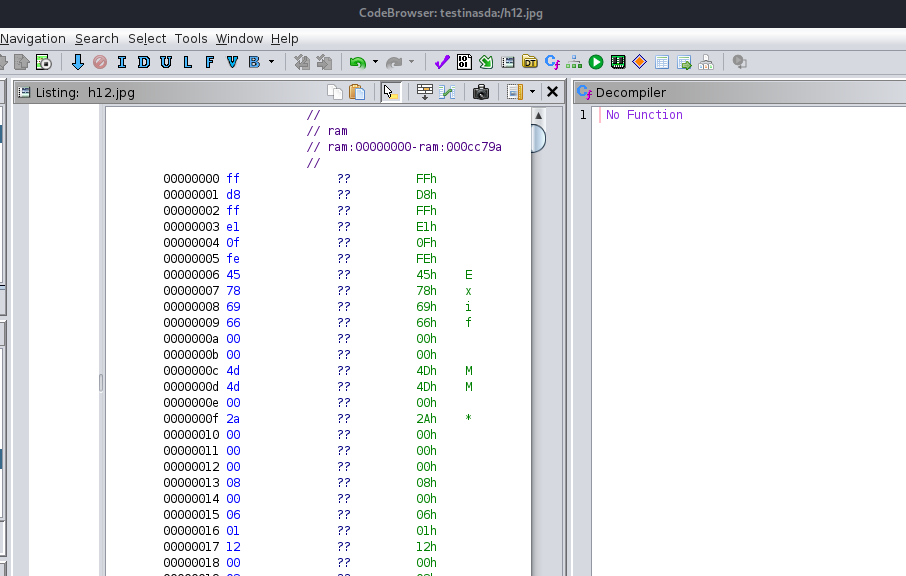
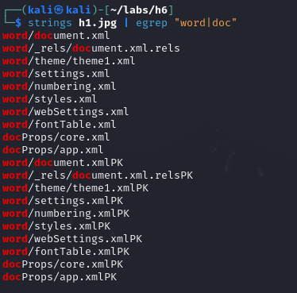
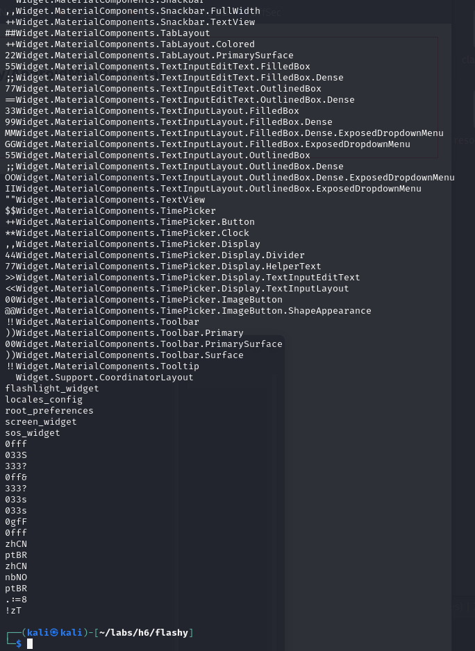

# 🌀 H6 - Melting Madness

## 📑 Contents

- [🌀 H6 - Melting Madness](#h6---melting-madness)
  - [📑 Contents](#contents)
  - [📋 Assignments](#assignments)
  - [🔍 A) Analyze File h1.jpg](#a-analyze-file-h1jpg)
  - [🛠️ B) Analyze File h1.jpg with Binwalk](#b-analyze-file-h1jpg-with-binwalk)
  - [📱 C) FOSS (Free Android Open Source)](#c-foss-free-android-open-source)
    - [📂 C1) ZIP](#c1-zip)
    - [📂 C2) JADX](#c2-jadx)
    - [📂 C3) Bytecode-viewer](#c3-bytecode-viewer)
  - [💡 D) Optional: ESP32 Projects](#d-optional-esp32-projects)
  - [🛠️ Tools and Hardware Used](#tools-and-hardware-used)
  - [📂 Resources](#resources)

## 📋 Assignments

 
Click to expand

A) Analyze File h1.jpg

Use previously learned tools to analyze the file.
B) Analyze File h1.jpg with Binwalk

Explore the file with binwalk.
Identify the new information extracted.
Determine which tool to use for extracting files.
C) FOSS (Free Android Open Source)

Pick an app from Offan’s Android FOSS list.
Visit its GitHub repository.
Download the APK and analyze it using:
C1) ZIP
C2) JADX
C3) Bytecode-viewer
D) Optional: ESP32 Projects

Select a project from Awesome ESP.
Investigate its ESP32 binary, analyze the data extracted, and compare it with GitHub code if available.

## 🔍 A) Analyze File h1.jpg with previous level tools

File command to see some general file information

`file h1.jpg`

 
 Does not seem to reveal much, i doubt its just a jpg

also ghidra does not seem to show anything special, tried with a couple different "Language" settings

image data extraction tool exiftool output:

does not seem to indicate anything unusual.

next up strings:

`strings h1.jpg`

this is printing lots of data, repeating command with | less

found some hints that the file would contain more files packed

`strings h1.jpg | egrep "word|doc"`

## 🛠️ B) Analyze File h1.jpg with next level tools: Binwalk

Found some hidden files inside image, to extract files:

`binwalk -e h1.jpg` 

seems to be contents of a word file?

examining some of the files:

### Examining files

`file 494F5.zip` reveals this "zip" file could be a word document?

renaming the file to 49.docx reveals document with some future predictions

the xml files contain data/metadata of the doc file

Rest of the files dont seem to have much revealing without digging deeper, decide to google some techiques to extract data with binwalk, found command to extract "all":

`binwalk --dd='.*' h1.jpg`

Looking at the output files in the explorer view, they contain image data also:

copied 4DE7B to jpg file

Opens normally, strings dont show anything special to me, also exiftool is pretty usual? 

4DE87 gives me error when trying to open it as image

Trying to extract the other files also unpacked the xml files with the zip "docx" file with the predictions

## 📱 C) FOSS (Free Android Open Source)

Tool/App chosen: Flashy
https://github.com/Crazy-Marvin/Flashy

downloaded newest version(13) from:
https://f-droid.org/en/packages/rocks.poopjournal.flashy/

### 📂 C1) ZIP

`unzip rocks.poopjournal.flashy_13.apk`

Files shown in explorer:

AndroidManifest.xml contains metadata about the app, package name, permissions etc.

DebugProbesKt.bin is related to kotlin debugging

resources.arsc file reveals a long list of all resources with `strings resources.arsc`

Folders mostly contain data and info that was compiled when app was made, 

- assets folder has raw files that are bundled into th APK, 

- kotlin folder has kotlin specific metadata and classes (app seems to be coded in kotlin)

- Meta-INF contains metadata and the manifest.mf file containing hashes for verifying the app

- res folder containing resources, images etc:

moving on to JADX for further examination

### 📂 C2) JADX

downloaded latest version(1.5.1) from
https://github.com/skylot/jadx/releases/tag/v1.5.1

`jadx-cli´

opening the apk file in jadx reveals a tree of code and files

The main java file is found here:

And is the same content as on github:
https://github.com/Crazy-Marvin/Flashy/blob/development/app/src/main/java/rocks/poopjournal/flashy/activities/MainActivity.java

Opening the APK and extracting the code is pretty straightforward, i have previously used apktool but this seems to be easier with search and naviation functions.

### 📂 C3) Bytecode-viewer

setting up:

Opening the viewer and giving it our apk file reveals similiar view as JADX

Opening some random class reveals two different views, decompiler and dissassembler:

The Decoded Resources folder seems valuable, since it contains some previously encoded files decoded. like the AndroidManifest.xml

Most of the code is cut into smali files

mainactivity.smali

the viewer also has ability to show the image files:

## 💡 D) Optional: ESP32 Projects

Having used many of these before, choosing one I use daily for home automation, Tasmota

Similiar to other esp32 binaries, `file` misidentiefies as DOS executable

`strings tasmota.bin` reveals lots of content in plain text:

`xxd tasmota.bin`

has lots of data, but hard to digest

`binwalk -e tasmota.bin`

Extracts us some files:

`strings 27423 | less`

this is slightly easier to read, but still has lots of useless data, this could be used also to look for certain things like ip addresses or passwords with grep

`strings 3Ef17 | less` 

has slightly less data, lots of it is readable

`strings 3EF17 | less` 

contains lots of readable information.

Ghidra
Choosing file and Xtensa language does some decompiling, still not close to the source on github, missing function names also.

Tried binary ninja also:

This was just a rough look at the binary, more intresting would be following the network traffic of IoT devices.

Just to try it out, also binwalked the meshtastic firmware, completely different results:

## 🛠️ Tools and Hardware Used
- Hardware: AMD 5900X, RTX 3080, 32GB RAM
- Ghidra, binwalk, strings, hexdump, bytecode viewer, JADX, binary ninja

## 📂 Resources

https://github.com/Crazy-Marvin/Flashy

https://terokarvinen.com/application-hacking/

https://notes.justin-p.me/cheatsheets/tools/binwalk/

https://www.cheat-sheets.org/project/tldr/command/binwalk/os/linux/

https://stackoverflow.com/questions/36530643/use-binwalk-to-extract-all-files

