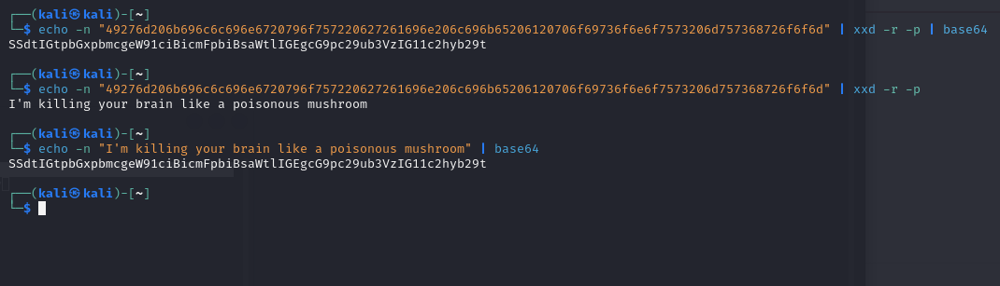
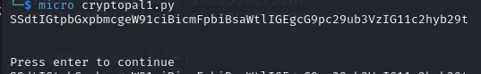
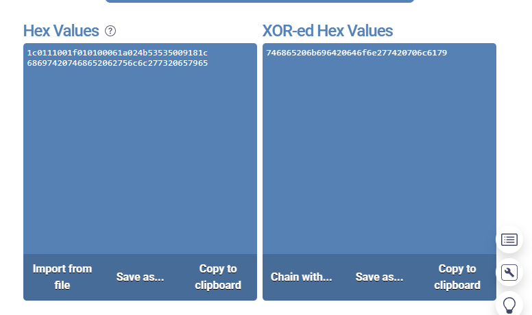
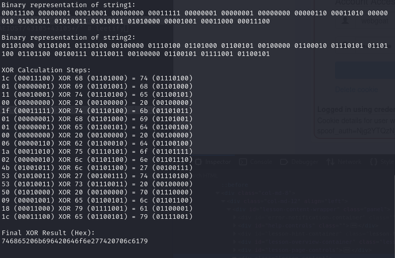
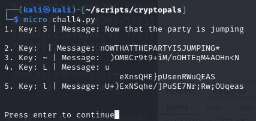

<a name="h7---uhagre2"></a>
# 🔐 H7 - Uhagre2

<a name="contents"></a>
## 📑 Contents

- [🔐 H7 - Uhagre2](#h7---uhagre2)
  - [📑 Contents](#contents)
  - [📋 Assignments](#assignments)
  - [📝 X) Read and Summarize](#x-read-and-summarize)
  - [⚙️ A) 1. Convert Hex to Base64](#a-1-convert-hex-to-base64)
  - [🔧 B) 2. Fixed XOR](#b-2-fixed-xor)
  - [🕵️ C) 3. Single-Byte XOR Cipher](#c-3-single-byte-xor-cipher)
  - [🔍 D) 4. Detect Single-Character XOR](#d-4-detect-single-character-xor)
  - [🔑 E) 5. Implement Repeating-Key XOR (Optional)](#e-5-implement-repeating-key-xor-optional)
  - [🔓 G) 6. Break Repeating-Key XOR (Optional)](#g-6-break-repeating-key-xor-optional)
  - [🛡️ H) 7. AES in ECB Mode (Optional)](#h-7-aes-in-ecb-mode-optional)
  - [📡 I) 8. Detect AES in ECB Mode (Optional)](#i-8-detect-aes-in-ecb-mode-optional)
  - [🛠️ Tools and Hardware Used](#tools-and-hardware-used)
  - [📂 Resources](#resources)

<a name="assignments"></a>
## 📋 Assignments

<details> <summary>Click to expand</summary>
X) Read and Summarize

Schneier 2015: Applied Cryptography:
1.1 Terminology
1.4 Simple XOR
1.7 Large Numbers
Karvinen 2024: Python Basics for Hackers
Optional:
Get Started Micro Editor
Getting Started with Cryptopals using Python
A) 1. Convert Hex to Base64

Convert a hexadecimal string to Base64.
B) 2. Fixed XOR

XOR two equal-length buffers.
C) 3. Single-Byte XOR Cipher

Decrypt single-byte XOR-encoded text.
D) 4. Detect Single-Character XOR

Detect the encoded line with single-byte XOR.
E) 5. Implement Repeating-Key XOR (Optional)

Implement a repeating-key XOR cipher.
G) 6. Break Repeating-Key XOR (Optional)

Break repeating-key XOR encryption.
H) 7. AES in ECB Mode (Optional)

Implement AES encryption in ECB mode.
I) 8. Detect AES in ECB Mode (Optional)

Detect AES encryption in ECB mode.
</details>

<a name="x-read-and-summarize"></a>
### 📝 X) Read and Summarize

#### Schneier 2015: Appliec cryptography 1.1
- Article about key concepts terminology

- MCED
    - (M)Plaintext
    - (C)Cipher
    - (D)Decrypt
    - (E)Encrypt

- Algorithm and Keys
    - Ciphering algorithms, usually a mathematical function.
    - (K) Keys are secret values to encrypt and decrypt

- Symmetric algorithms
    - Symmetric algorithms can ebe calulated from the decryption key
    - AES

- Public Key Algorithms
    - Different keys for encryption and decryption
    - RSA

- Security of algorithms
    - Different ways of cracking the encryption

#### Schneier 2015: Appliec cryptography 1.4

- XOR
    - Exclusive or operation
    - Standard operation in bits where 0 and 1:s are compared 


#### Schneier 2015: Appliec cryptography 1.7

- Large numbers section compares large numbers to real life/world events and probabilities

#### Karvinen 2024: Python Basics for Hackers

https://terokarvinen.com/python-for-hackers/


- Useful article with tips and tricks to automate, convert or calulate common encryptions, sorting lists, tips for libraries, could be useful cheatsheet for the cryptopals tasks and CTF


<a name="a-1-convert-hex-to-base64"></a>
## ⚙️ A) 1. Convert Hex to Base64

https://cryptopals.com/sets/1/challenges/1


First transforming the hex to string
```
echo -n "49276d206b696c6c696e6720796f757220627261696e206c696b65206120706f69736f6e6f7573206d757368726f6f6d" | xxd -r -p
```

then string to base64

```
echo -n "I'm killing your brain like a poisonous mushroom" | base64
```

Or pipe it together:

```
echo -n "49276d206b696c6c696e6720796f757220627261696e206c696b65206120706f69736f6e6f7573206d757368726f6f6d" | xxd -r -p | base64
```



With python a simple conversion using base64 library:

```
import base64

def hex_to_base64(hex_string):
    raw_bytes = bytes.fromhex(hex_string)
    base64_bytes = base64.b64encode(raw_bytes)
    return base64_bytes.decode('utf-8')

hex_string = "49276d206b696c6c696e6720796f757220627261696e206c696b65206120706f69736f6e6f7573206d757368726f6f6d"

base64_result = hex_to_base64(hex_string)

print(base64_result)
```



<a name="b-2-fixed-xor"></a>
## 🔧 B) 2. Fixed XOR

https://www.cryptopals.com/sets/1/challenges/2

This is still a fraily simple hex XOR calculation, and there are several online tools to calulate these ontop of the commands above, and the python code featured on terokarvinen.com

https://onlinetools.com/hex/xor-hex-numbers




Alternatively this python script created in H3 optional homework:

```
import binascii

# Define the input hex strings
hex_string1 = "1c0111001f010100061a024b53535009181c"
hex_string2 = "686974207468652062756c6c277320657965"

# Decode the hex strings into byte buffers
buffer1 = binascii.unhexlify(hex_string1)
buffer2 = binascii.unhexlify(hex_string2)

# Print hex strings in binary
print("Binary representation of string1:")
print(' '.join(format(byte, '08b') for byte in buffer1))

print("\nBinary representation of string2:")
print(' '.join(format(byte, '08b') for byte in buffer2))

# Perform XOR calculation with binary output for each step
print("\nXOR Calculation Steps:")
for a, b in zip(buffer1, buffer2):
    xor_byte = a ^ b
    print(f"{a:02x} ({format(a, '08b')}) XOR {b:02x} ({format(b, '08b')}) = {xor_byte:02x} ({format(xor_byte, '08b')})")

# Perform XOR operation and get the result as bytes
xor_result = bytes(a ^ b for a, b in zip(buffer1, buffer2))

# Print final XOR result in hex
print("\nFinal XOR Result (Hex):")
print(binascii.hexlify(xor_result).decode())
```

This tool/script has built in explanations and calculations for simplifying the learning of XOR:




Simplified rewritten for this weeks homework modified from the first task:
```
import base64
import binascii

def hex_to_base64(hex_string):
    return base64.b64encode(binascii.unhexlify(hex_string)).decode('utf-8')

hex_string = "49276d206b696c6c696e6720796f757220627261696e206c696b65206120706f69736f6e6f7573206d757368726f6f6d"

print("base64:", hex_to_base64(hex_string))

```

<a name="c-3-single-byte-xor-cipher"></a>
## 🕵️ C) 3. Single-Byte XOR Cipher

https://www.cryptopals.com/sets/1/challenges/3

Useful online tools to solve
https://scwf.dima.ninja/#strings
https://github.com/Ciphey/Ciphey

Articles/guides read

https://www.youtube.com/watch?app=desktop&v=tE2iW_QAU1A

https://stackoverflow.com/questions/41819489/single-byte-xor-cipher-python

Python solution with ranked letter frequency for english language

```
import string

def single_byte_xor(input_bytes, key):
    return bytes([b ^ key for b in input_bytes])

# Function to score English plaintext based on character frequency
def score_english_text(text):
    frequencies = {
        'E': 11.2, 'A': 8.5, 'R': 7.6, 'I': 7.5, 'O': 7.2, 'T': 7.0,
        'N': 6.7, 'S': 5.7, 'L': 5.5, 'C': 4.5, 'U': 3.6, 'D': 3.4,
        'P': 3.2, 'M': 3.0, 'H': 3.0, 'G': 2.5, 'B': 2.1, 'F': 1.8,
        'Y': 1.8, 'W': 1.3, 'K': 1.1, 'V': 1.0, 'X': 0.3, 'Z': 0.3,
        'J': 0.2, 'Q': 0.2, ' ': 13.0
    }
    
    return sum(frequencies.get(chr(b).lower(), 0) for b in text if chr(b) in string.printable)


def find_single_byte_xor_key(hex_string):
    input_bytes = bytes.fromhex(hex_string)
    best_score = 0
    best_result = None
    key_used = None

    for key in range(256):
        decrypted_text = single_byte_xor(input_bytes, key)
        score = score_english_text(decrypted_text)

        if score > best_score:
            best_score = score
            best_result = decrypted_text
            key_used = key

    return key_used, best_result.decode('utf-8', errors='ignore')


hex_string = "1b37373331363f78151b7f2b783431333d78397828372d363c78373e783a393b3736"

key, message = find_single_byte_xor_key(hex_string)
print(f"key: {chr(key)} (ASCII {key})")
print(f"decrypted message: {message}")

```

<a name="d-4-detect-single-character-xor"></a>
## 🔍 D) 4. Detect Single-Character XOR

Added all the strings to a file, strings.txt, read several articles about creating such script, hard to avoid walkthroughs or spoilers since cryptopals seems popular

https://stackoverflow.com/questions/41838945/detecting-a-single-character-xor-cipher

https://dev.to/stefanalfbo/detect-single-character-xor-4gi8

https://www.codementor.io/@arpitbhayani/deciphering-single-byte-xor-ciphertext-17mtwlzh30

modified previous code to include strings file as inputs

```diff
import string

def single_byte_xor(input_bytes, key):
    return bytes([b ^ key for b in input_bytes])

# Function to score English plaintext based on character frequency
def score_english_text(text):
    frequencies = {
        'E': 11.2, 'A': 8.5, 'R': 7.6, 'I': 7.5, 'O': 7.2, 'T': 7.0,
        'N': 6.7, 'S': 5.7, 'L': 5.5, 'C': 4.5, 'U': 3.6, 'D': 3.4,
        'P': 3.2, 'M': 3.0, 'H': 3.0, 'G': 2.5, 'B': 2.1, 'F': 1.8,
        'Y': 1.8, 'W': 1.3, 'K': 1.1, 'V': 1.0, 'X': 0.3, 'Z': 0.3,
        'J': 0.2, 'Q': 0.2, ' ': 13.0
    }
    return sum(frequencies.get(chr(b).upper(), 0) for b in text if chr(b) in string.printable)

+def find_top_5_single_byte_xor_keys_from_file(file_path):
+    results = []
+
+    with open(file_path, 'r') as file:
+        for line in file:
+            hex_string = line.strip()
+            if not hex_string:
+                continue
+            input_bytes = bytes.fromhex(hex_string)
+            
            for key in range(256):
                decrypted_text = single_byte_xor(input_bytes, key)
                score = score_english_text(decrypted_text)
+                results.append((score, key, decrypted_text.decode('utf-8', errors='ignore')))
    

+    top_5_results = sorted(results, key=lambda x: x[0], reverse=True)[:5]
+    return top_5_results

+# strings file
+file_path = "strings.txt"

+top_5_results = find_top_5_single_byte_xor_keys_from_file(file_path)

+for rank, (_, key, message) in enumerate(top_5_results, start=1):
+    print(f"{rank}. Key: {chr(key)} | Message: {message}")


```



<a name="e-5-implement-repeating-key-xor-optional"></a>
## 🔑 E) 5. Implement Repeating-Key XOR (Optional)

<a name="g-6-break-repeating-key-xor-optional"></a>
## 🔓 G) 6. Break Repeating-Key XOR (Optional)

<a name="h-7-aes-in-ecb-mode-optional"></a>
## 🛡️ H) 7. AES in ECB Mode (Optional)

<a name="i-8-detect-aes-in-ecb-mode-optional"></a>
## 📡 I) 8. Detect AES in ECB Mode (Optional)

<a name="tools-and-hardware-used"></a>
## 🛠️ Tools and Hardware Used
- Hardware: AMD 5900X, RTX 3080, 32GB RAM
- Tools: Python, Micro Editor, CryptoPals challenges, Hex/Binary converters

<a name="resources"></a>
## 📂 Resources

Schneier 2015: Applied Cryptography  

CryptoPals Challenges: https://cryptopals.com  

https://terokarvinen.com/application-hacking/
Karvinen 2024 

https://terokarvinen.com/python-for-hackers/

https://www.geeksforgeeks.org/encoding-and-decoding-base64-strings-in-python/

https://gchq.github.io/CyberChef/